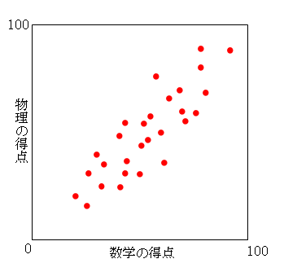

### 第3章 2次元データのまとめ方  
---

#### 3.1 2次元の質的データの記述  
**分割表(クロス集計表)**  

学歴と支持政党:2×2分割表  

<table>
<tr><td></td><td>大卒</td><td>その他</td><td>計</td></tr>
<tr><td>保守</td><td>230</td><td>250</td><td>450</td></tr>
<tr><td>革新</td><td>120</td><td>200</td><td>320</td></tr>
<tr><td>計</td><td>350</td><td>450</td><td>800</td></tr>
</table>

**関連性の尺度** , **層別の重要性**  
テキストを参照  

---
#### 3.2 2次元の量的データの記述-散布図,相関係数-

このような図を **散布図** (または **相関図** )という.  
この図を眺めるだけで,2つの変数の間の関連性についての傾向を把握することができる.  

数学の得点が高ければ物理の得点も高いという傾向がでている.  

一方の変数の値が大きくなる時,他方の変数の値が直線的に大きくなる傾向がある時,2つの変数の間には **正の相関(関係)** が存在するという.逆に,一方の変数の値が大きくなる時,他方の変数の値が直線的に小さくなる傾向がある時,2つの変数の間には **負の相関(関係)** が存在するという.相関関係が見られない時,相関(関係)がない,あるいは,無相関であるという.  

**相関係数**  

2つの変数xとyについてn組の観測値が得られた時,xとyの **相関係数** rは,  
  
である.  

(y_{i}-\\overline y)}{n-1})  
はxとyの **共分散** とよばれる.  

